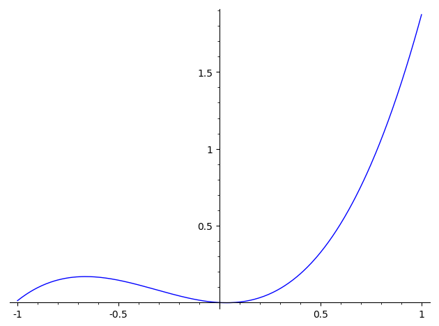

We want to compute $A^*_4$. In other words, we are looking for the coefficients of a convex polynomial
$p(x,y)=\sum_{i=0}^8 a_i x^i y^{8-i}$
that maximizes $\frac{a_4}{70}$ and satisfies $a_0=a_8=1$.

If $p(x, y)$ is an optimal solution, so is $p(y, x)$. We can therefore take $a_i = a_{8 - i}$ for $i=1,\ldots,7$.


```python
import numpy as np
import sage_sdp  
from scipy.sparse import csc_matrix

# helper functions for symmetry reduction
import isotypical_decomposition
```


```python
d = 4
a = tuple([polygen(QQ, 'a'+str(i)) for i in range(1, d+1)])
R.<x,y,u,v> = QQ[a]['x,y,u,v']
a = tuple(map(R, a))
a_repeated = (1,) + a[:-1] + a[::-1] + (1,)
show(a)
vars = [x,y,u,v]
q = sum([ a_repeated[i] * x^i * y^(2*d-i) * binomial(2*d, i)
         for i in range(2*d+1)])
obj = q.coefficient(x^d*y^d)
print "We want to maximize the variable `{obj}` and keep the form below convex."\
            .format(obj=obj)
show(q)
show(a)
```


<html><script type="math/tex; mode=display">\newcommand{\Bold}[1]{\mathbf{#1}}\left(a_{1}, a_{2}, a_{3}, a_{4}\right)</script></html>


    We want to maximize the variable `70*a4` and keep the form below convex.


<html><script type="math/tex; mode=display">\newcommand{\Bold}[1]{\mathbf{#1}}x^{8} + \left(8 a_{1}\right) x^{7} y + \left(28 a_{2}\right) x^{6} y^{2} + \left(56 a_{3}\right) x^{5} y^{3} + \left(70 a_{4}\right) x^{4} y^{4} + \left(56 a_{3}\right) x^{3} y^{5} + \left(28 a_{2}\right) x^{2} y^{6} + \left(8 a_{1}\right) x y^{7} + y^{8}</script></html>


<html><script type="math/tex; mode=display">\newcommand{\Bold}[1]{\mathbf{#1}}\left(a_{1}, a_{2}, a_{3}, a_{4}\right)</script></html>


```python
Hq = jacobian(jacobian(q, (x, y)), (x, y))
H_quadratic_form = vector([u, v]) * Hq * vector([u, v])
print("q sos is equivalent to the form below being sos.")
show("H_quadratic_form = ", H_quadratic_form)
```

    q sos is equivalent to the form below being sos.


<html><script type="math/tex; mode=display">\newcommand{\Bold}[1]{\mathbf{#1}}\verb|H_quadratic_form|\phantom{\verb!x!}\verb|=| 56 x^{6} u^{2} + \left(336 a_{1}\right) x^{5} y u^{2} + \left(840 a_{2}\right) x^{4} y^{2} u^{2} + \left(1120 a_{3}\right) x^{3} y^{3} u^{2} + \left(840 a_{4}\right) x^{2} y^{4} u^{2} + \left(336 a_{3}\right) x y^{5} u^{2} + \left(56 a_{2}\right) y^{6} u^{2} + \left(112 a_{1}\right) x^{6} u v + \left(672 a_{2}\right) x^{5} y u v + \left(1680 a_{3}\right) x^{4} y^{2} u v + \left(2240 a_{4}\right) x^{3} y^{3} u v + \left(1680 a_{3}\right) x^{2} y^{4} u v + \left(672 a_{2}\right) x y^{5} u v + \left(112 a_{1}\right) y^{6} u v + \left(56 a_{2}\right) x^{6} v^{2} + \left(336 a_{3}\right) x^{5} y v^{2} + \left(840 a_{4}\right) x^{4} y^{2} v^{2} + \left(1120 a_{3}\right) x^{3} y^{3} v^{2} + \left(840 a_{2}\right) x^{2} y^{4} v^{2} + \left(336 a_{1}\right) x y^{5} v^{2} + 56 y^{6} v^{2}</script></html>


# SDP formulation

`𝙷⎯𝚚𝚞𝚊𝚍𝚛𝚊𝚝𝚒𝚌⎯𝚏𝚘𝚛𝚖` is sos if and only if it can be written as $z^T Q z,$
where $Q$ is an $(2d-2)\times (2d-2)$ psd matrix and $z$ is the vector of monomials. (See below.)


```python
#  H_quadratic_form sos if H_quadratic_form = z *
mons_xy = vector([x^i * y^(d-i-1) for i in range(d)])
mons = vector(list(u * mons_xy) + list(v * mons_xy))
show("Consider the monomials in (x,y,u,v): ", mons)
show("and the {i} x {i} matrix".format(i=len(mons)))

Q = sage_sdp.symb_matrix(len(mons), "Q")
show(Q[:5, :5], '...')

opt_variables = Q.variables() + a
print("New decision variables:")
show(opt_variables)
```


<html><script type="math/tex; mode=display">\newcommand{\Bold}[1]{\mathbf{#1}}\verb|Consider|\phantom{\verb!x!}\verb|the|\phantom{\verb!x!}\verb|monomials|\phantom{\verb!x!}\verb|in|\phantom{\verb!x!}\verb|(x,y,u,v):| \left(y^{3} u,\,x y^{2} u,\,x^{2} y u,\,x^{3} u,\,y^{3} v,\,x y^{2} v,\,x^{2} y v,\,x^{3} v\right)</script></html>


<html><script type="math/tex; mode=display">\newcommand{\Bold}[1]{\mathbf{#1}}\verb|and|\phantom{\verb!x!}\verb|the|\phantom{\verb!x!}\verb|8|\phantom{\verb!x!}\verb|x|\phantom{\verb!x!}\verb|8|\phantom{\verb!x!}\verb|matrix|</script></html>


<html><script type="math/tex; mode=display">\newcommand{\Bold}[1]{\mathbf{#1}}\left(\begin{array}{rrrrr}
Q_{11} & Q_{21} & Q_{31} & Q_{41} & Q_{51} \\
Q_{21} & Q_{22} & Q_{32} & Q_{42} & Q_{52} \\
Q_{31} & Q_{32} & Q_{33} & Q_{43} & Q_{53} \\
Q_{41} & Q_{42} & Q_{43} & Q_{44} & Q_{54} \\
Q_{51} & Q_{52} & Q_{53} & Q_{54} & Q_{55}
\end{array}\right) \verb|...|</script></html>


    New decision variables:


<html><script type="math/tex; mode=display">\newcommand{\Bold}[1]{\mathbf{#1}}\left(Q_{11}, Q_{21}, Q_{22}, Q_{31}, Q_{32}, Q_{33}, Q_{41}, Q_{42}, Q_{43}, Q_{44}, Q_{51}, Q_{52}, Q_{53}, Q_{54}, Q_{55}, Q_{61}, Q_{62}, Q_{63}, Q_{64}, Q_{65}, Q_{66}, Q_{71}, Q_{72}, Q_{73}, Q_{74}, Q_{75}, Q_{76}, Q_{77}, Q_{81}, Q_{82}, Q_{83}, Q_{84}, Q_{85}, Q_{86}, Q_{87}, Q_{88}, a_{1}, a_{2}, a_{3}, a_{4}\right)</script></html>


The identity $u^T\nabla^2 q u - z^TQz = 0$ is equivalent to a list of equalities involving the coefficients of $Q$ and the vector $a$ linearly  (one for each monomial). We report these linear equalities in the table below


```python
residual = H_quadratic_form - mons * Q * mons
RR = QQ[opt_variables][x, y, u, v]
residual = RR(residual)
linear_eq = residual.coefficients()


table([residual.monomials(), [LatexExpr("{}=0".format(mi)) for mi in linear_eq]], 
      header_column=["monomial", "corresponding linear equality"])\
    .transpose()
```


<div class="notruncate">
<table  class="table_form">
<tbody>
<tr>
<th>monomial</th>
<th>corresponding linear equality</th>
</tr>
<tr class ="row-a">
<td><script type="math/tex">x^{6} u^{2}</script></td>
<td>-Q_44 + 56=0</td>
</tr>
<tr class ="row-b">
<td><script type="math/tex">x^{5} y u^{2}</script></td>
<td>-2*Q_43 + 336*a1=0</td>
</tr>
<tr class ="row-a">
<td><script type="math/tex">x^{4} y^{2} u^{2}</script></td>
<td>-Q_33 - 2*Q_42 + 840*a2=0</td>
</tr>
<tr class ="row-b">
<td><script type="math/tex">x^{3} y^{3} u^{2}</script></td>
<td>-2*Q_32 - 2*Q_41 + 1120*a3=0</td>
</tr>
<tr class ="row-a">
<td><script type="math/tex">x^{2} y^{4} u^{2}</script></td>
<td>-Q_22 - 2*Q_31 + 840*a4=0</td>
</tr>
<tr class ="row-b">
<td><script type="math/tex">x y^{5} u^{2}</script></td>
<td>-2*Q_21 + 336*a3=0</td>
</tr>
<tr class ="row-a">
<td><script type="math/tex">y^{6} u^{2}</script></td>
<td>-Q_11 + 56*a2=0</td>
</tr>
<tr class ="row-b">
<td><script type="math/tex">x^{6} u v</script></td>
<td>-2*Q_84 + 112*a1=0</td>
</tr>
<tr class ="row-a">
<td><script type="math/tex">x^{5} y u v</script></td>
<td>-2*Q_74 - 2*Q_83 + 672*a2=0</td>
</tr>
<tr class ="row-b">
<td><script type="math/tex">x^{4} y^{2} u v</script></td>
<td>-2*Q_64 - 2*Q_73 - 2*Q_82 + 1680*a3=0</td>
</tr>
<tr class ="row-a">
<td><script type="math/tex">x^{3} y^{3} u v</script></td>
<td>-2*Q_54 - 2*Q_63 - 2*Q_72 - 2*Q_81 + 2240*a4=0</td>
</tr>
<tr class ="row-b">
<td><script type="math/tex">x^{2} y^{4} u v</script></td>
<td>-2*Q_53 - 2*Q_62 - 2*Q_71 + 1680*a3=0</td>
</tr>
<tr class ="row-a">
<td><script type="math/tex">x y^{5} u v</script></td>
<td>-2*Q_52 - 2*Q_61 + 672*a2=0</td>
</tr>
<tr class ="row-b">
<td><script type="math/tex">y^{6} u v</script></td>
<td>-2*Q_51 + 112*a1=0</td>
</tr>
<tr class ="row-a">
<td><script type="math/tex">x^{6} v^{2}</script></td>
<td>-Q_88 + 56*a2=0</td>
</tr>
<tr class ="row-b">
<td><script type="math/tex">x^{5} y v^{2}</script></td>
<td>-2*Q_87 + 336*a3=0</td>
</tr>
<tr class ="row-a">
<td><script type="math/tex">x^{4} y^{2} v^{2}</script></td>
<td>-Q_77 - 2*Q_86 + 840*a4=0</td>
</tr>
<tr class ="row-b">
<td><script type="math/tex">x^{3} y^{3} v^{2}</script></td>
<td>-2*Q_76 - 2*Q_85 + 1120*a3=0</td>
</tr>
<tr class ="row-a">
<td><script type="math/tex">x^{2} y^{4} v^{2}</script></td>
<td>-Q_66 - 2*Q_75 + 840*a2=0</td>
</tr>
<tr class ="row-b">
<td><script type="math/tex">x y^{5} v^{2}</script></td>
<td>-2*Q_65 + 336*a1=0</td>
</tr>
<tr class ="row-a">
<td><script type="math/tex">y^{6} v^{2}</script></td>
<td>-Q_55 + 56=0</td>
</tr>
</tbody>
</table>
</div>


# Construct a symmetry-adapted basis of monomials


```python
# permutation group of symmetries
vars = [x, y, u, v]
symmetries =[[y,x,v,u],]
if d % 2 == 0:
    symmetries += [[-x,y,-u,v], [x,-y,-u,v]]
else:
    symmetries += [[-x,-y,-u,-v]]
symmetries_rho = map(lambda sym_i: matrix(QQ, jacobian(sym_i, vars)), symmetries)
G_sage = MatrixGroup(symmetries_rho)


print("The symmetries of the problem")
show(symmetries)
print "are represented by the group of", len(G_sage), "elements:"
show(G_sage)
```

    The symmetries of the problem


<html><script type="math/tex; mode=display">\newcommand{\Bold}[1]{\mathbf{#1}}\left[\left[y, x, v, u\right], \left[-x, y, -u, v\right], \left[x, -y, -u, v\right]\right]</script></html>


    are represented by the group of 16 elements:


<html><script type="math/tex; mode=display">\newcommand{\Bold}[1]{\mathbf{#1}}\left\langle \left(\begin{array}{rrrr}
0 & 1 & 0 & 0 \\
1 & 0 & 0 & 0 \\
0 & 0 & 0 & 1 \\
0 & 0 & 1 & 0
\end{array}\right), \left(\begin{array}{rrrr}
-1 & 0 & 0 & 0 \\
0 & 1 & 0 & 0 \\
0 & 0 & -1 & 0 \\
0 & 0 & 0 & 1
\end{array}\right), \left(\begin{array}{rrrr}
1 & 0 & 0 & 0 \\
0 & -1 & 0 & 0 \\
0 & 0 & -1 & 0 \\
0 & 0 & 0 & 1
\end{array}\right) \right\rangle</script></html>


```python

def get_irreducible_repr(G_sage):
    """Utility function to compute irreducible representations of a group using gap."""
    G_gap = gap.Group(map(lambda M: matrix(QQ, M), G_sage.gens()))
    irr_repr = []
    gap_irr_repr = gap.IrreducibleRepresentations(G_gap)
    characters = gap.Irr( G_gap )
    for irr in gap_irr_repr:            
        sage_irr = gap.UnderlyingRelation(irr)
        sage_irr = sage_irr.AsList()
        sage_irr = map(lambda u: list(u.AsList()),
                       sage_irr)  
        sage_irr = map(lambda elem_img: ((elem_img[0]), 
                                         elem_img[1].sage()), sage_irr)
        gens, vals = zip(*sage_irr)
        vals = map(lambda v: matrix(QQ, v), vals)
        gens_vals_dict = {G_sage(g): v for g,v in zip(gens, vals)}
        hom_irr = lambda g, gens_vals_dict=gens_vals_dict: gens_vals_dict[g]
        irr_repr.append(hom_irr)
    return irr_repr

irr_repr = get_irreducible_repr(G_sage)
```


```python
# induced action on the vector of monomials z
def action_on_monomials(g):
    mons_permuted = mons.subs({vi: subi 
                               for vi, subi in zip(vars, g*vector(vars))})
    # construct permutation matrix
    col = np.array(range(len(mons)))
    basis_idx = {b: i for i,b in enumerate(mons)}
    row = [ basis_idx[m] if m in basis_idx else basis_idx[-m]  
           for m in mons_permuted]
    data = [1 if m in basis_idx else -1 for m in mons_permuted]
    return csc_matrix((data, (row, col))).todense()

print("Example of the action of G on the vector of monomials")
g = G_sage.random_element()
show(g, LatexExpr(r"\cdot"), vector(mons),
     " = ", matrix(QQ,action_on_monomials(g)) * mons)
```

    Example of the action of G on the vector of monomials


<html><script type="math/tex; mode=display">\newcommand{\Bold}[1]{\mathbf{#1}}\left(\begin{array}{rrrr}
-1 & 0 & 0 & 0 \\
0 & 1 & 0 & 0 \\
0 & 0 & 1 & 0 \\
0 & 0 & 0 & -1
\end{array}\right) \cdot \left(y^{3} u,\,x y^{2} u,\,x^{2} y u,\,x^{3} u,\,y^{3} v,\,x y^{2} v,\,x^{2} y v,\,x^{3} v\right) \phantom{\verb!x!}\verb|=| \left(y^{3} u,\,-x y^{2} u,\,x^{2} y u,\,-x^{3} u,\,-y^{3} v,\,x y^{2} v,\,-x^{2} y v,\,x^{3} v\right)</script></html>


```python
# compute a basis for the isotypical compononents of span(mons)
basis_iso = [isotypical_decomposition.\
             compute_basis_isotypical_comp(chi, action_on_monomials, G_sage) 
             for chi in irr_repr]

# compute a symmetry adapted basis
adapted_basis = []
for j, Vj in enumerate(basis_iso):
    if Vj is not None: 
        adapted_basis.append([ Vij * mons for Vij in Vj])
        
print("Symmetry adapted basis:")
show(adapted_basis)
```

    Symmetry adapted basis:


<html><script type="math/tex; mode=display">\newcommand{\Bold}[1]{\mathbf{#1}}\left[\left[\left(x y^{2} u + x^{2} y v,\,x^{3} u + y^{3} v\right)\right], \left[\left(y^{3} u + x^{3} v,\,x^{2} y u + x y^{2} v\right)\right], \left[\left(x y^{2} u - x^{2} y v,\,x^{3} u - y^{3} v\right)\right], \left[\left(y^{3} u - x^{3} v,\,x^{2} y u - x y^{2} v\right)\right]\right]</script></html>


```python
print("Let's build the semidefinite program")
size_Qs = map(lambda u: len(u[0]), adapted_basis)
Qs = [sage_sdp.symb_matrix(len(bi[0]), "Q"+str(i+1)) for i, bi in enumerate(adapted_basis)]
print("The matrix Q in the symmetry adapted basis has the following block diagonalization (with multiplicity):")
show([(len(bi), LatexExpr(r'\times'), Qi) for bi, Qi in zip(adapted_basis, Qs)])


Qs_vars = tuple(sum([list(Qi.variables()) for Qi in Qs], []))
decision_vars = Qs_vars + a
RR = QQ[decision_vars][x,y,u,v]
reduced_r = RR(H_quadratic_form  - \
       sum( sum( bij*Qi*bij for bij in bi ) for bi, Qi in zip(adapted_basis, Qs) ))
```

    Let's build the semidefinite program
    The matrix Q in the symmetry adapted basis has the following block diagonalization (with multiplicity):


<html><script type="math/tex; mode=display">\newcommand{\Bold}[1]{\mathbf{#1}}\left[\left(1, \times, \left(\begin{array}{rr}
\mathit{Q1}_{11} & \mathit{Q1}_{21} \\
\mathit{Q1}_{21} & \mathit{Q1}_{22}
\end{array}\right)\right), \left(1, \times, \left(\begin{array}{rr}
\mathit{Q2}_{11} & \mathit{Q2}_{21} \\
\mathit{Q2}_{21} & \mathit{Q2}_{22}
\end{array}\right)\right), \left(1, \times, \left(\begin{array}{rr}
\mathit{Q3}_{11} & \mathit{Q3}_{21} \\
\mathit{Q3}_{21} & \mathit{Q3}_{22}
\end{array}\right)\right), \left(1, \times, \left(\begin{array}{rr}
\mathit{Q4}_{11} & \mathit{Q4}_{21} \\
\mathit{Q4}_{21} & \mathit{Q4}_{22}
\end{array}\right)\right)\right]</script></html>


The identity $u^T\nabla^2 q u - z^TQz = 0$ is equivalent to a list of equalities involving the coefficients of $Q$ linearly  (one for each monomial $m$)
$$\langle A_m,  Q\rangle = 0.$$
We report these linear equalities in the table below


```python
linear_eq = reduced_r.coefficients()
table([reduced_r.monomials(), [LatexExpr("{}=0".format(mi)) for mi in linear_eq]], 
      header_column=["monomial", "corresponding linear equality"])\
    .transpose()
```


<div class="notruncate">
<table  class="table_form">
<tbody>
<tr>
<th>monomial</th>
<th>corresponding linear equality</th>
</tr>
<tr class ="row-a">
<td><script type="math/tex">x^{6} u^{2}</script></td>
<td>-Q1_22 - Q3_22 + 56=0</td>
</tr>
<tr class ="row-b">
<td><script type="math/tex">x^{5} y u^{2}</script></td>
<td>336*a1=0</td>
</tr>
<tr class ="row-a">
<td><script type="math/tex">x^{4} y^{2} u^{2}</script></td>
<td>-2*Q1_21 - Q2_22 - 2*Q3_21 - Q4_22 + 840*a2=0</td>
</tr>
<tr class ="row-b">
<td><script type="math/tex">x^{3} y^{3} u^{2}</script></td>
<td>1120*a3=0</td>
</tr>
<tr class ="row-a">
<td><script type="math/tex">x^{2} y^{4} u^{2}</script></td>
<td>-Q1_11 - 2*Q2_21 - Q3_11 - 2*Q4_21 + 840*a4=0</td>
</tr>
<tr class ="row-b">
<td><script type="math/tex">x y^{5} u^{2}</script></td>
<td>336*a3=0</td>
</tr>
<tr class ="row-a">
<td><script type="math/tex">y^{6} u^{2}</script></td>
<td>-Q2_11 - Q4_11 + 56*a2=0</td>
</tr>
<tr class ="row-b">
<td><script type="math/tex">x^{6} u v</script></td>
<td>112*a1=0</td>
</tr>
<tr class ="row-a">
<td><script type="math/tex">x^{5} y u v</script></td>
<td>-2*Q1_21 - 2*Q2_21 + 2*Q3_21 + 2*Q4_21 + 672*a2=0</td>
</tr>
<tr class ="row-b">
<td><script type="math/tex">x^{4} y^{2} u v</script></td>
<td>1680*a3=0</td>
</tr>
<tr class ="row-a">
<td><script type="math/tex">x^{3} y^{3} u v</script></td>
<td>-2*Q1_11 - 2*Q1_22 - 2*Q2_11 - 2*Q2_22 + 2*Q3_11 + 2*Q3_22 + 2*Q4_11 + 2*Q4_22 + 2240*a4=0</td>
</tr>
<tr class ="row-b">
<td><script type="math/tex">x^{2} y^{4} u v</script></td>
<td>1680*a3=0</td>
</tr>
<tr class ="row-a">
<td><script type="math/tex">x y^{5} u v</script></td>
<td>-2*Q1_21 - 2*Q2_21 + 2*Q3_21 + 2*Q4_21 + 672*a2=0</td>
</tr>
<tr class ="row-b">
<td><script type="math/tex">y^{6} u v</script></td>
<td>112*a1=0</td>
</tr>
<tr class ="row-a">
<td><script type="math/tex">x^{6} v^{2}</script></td>
<td>-Q2_11 - Q4_11 + 56*a2=0</td>
</tr>
<tr class ="row-b">
<td><script type="math/tex">x^{5} y v^{2}</script></td>
<td>336*a3=0</td>
</tr>
<tr class ="row-a">
<td><script type="math/tex">x^{4} y^{2} v^{2}</script></td>
<td>-Q1_11 - 2*Q2_21 - Q3_11 - 2*Q4_21 + 840*a4=0</td>
</tr>
<tr class ="row-b">
<td><script type="math/tex">x^{3} y^{3} v^{2}</script></td>
<td>1120*a3=0</td>
</tr>
<tr class ="row-a">
<td><script type="math/tex">x^{2} y^{4} v^{2}</script></td>
<td>-2*Q1_21 - Q2_22 - 2*Q3_21 - Q4_22 + 840*a2=0</td>
</tr>
<tr class ="row-b">
<td><script type="math/tex">x y^{5} v^{2}</script></td>
<td>336*a1=0</td>
</tr>
<tr class ="row-a">
<td><script type="math/tex">y^{6} v^{2}</script></td>
<td>-Q1_22 - Q3_22 + 56=0</td>
</tr>
</tbody>
</table>
</div>


Full dimensional description of the set

$\mathcal L := \{ v := (a, Q) \quad | \quad \text{$Q$ is psd and has the block diagonal structure described above and $a$ and $Q$ satisfy the linear equalities above} \}$
$\mathcal L := \{ v := (a, Q) \quad | \quad \text{$Q$  is psd and has the block diagonal structure described above and } A v = b \}$
$\mathcal L := \{ v := (a, Q) \quad | \quad v = v_0 + N \alpha, \alpha \in \mathbb R^k \},$
where $ker(A) =: \{N\alpha | \alpha \in \mathbb R^k\}$, and $k = dim(Ker(A))$

Let us construct the matrix $A$, the vector $b$, the vector $v_0$, and the matrix $N$.


```python
def get_full_dim_description(linear_eq, vars, name='alpha'):
    A = matrix(QQ, jacobian(vector(SR, linear_eq), vector(vars)))
    b = vector(linear_eq) - A * vector(vars)
    v0 = A.solve_right(b)
    ker_A = matrix(SR, A.transpose().kernel().basis())
    alpha = tuple([var(name+str(i)) for i in range(1, ker_A.dimensions()[0]+1)])
    
    full_dim_vars = vector(v0) + ker_A.transpose() * vector(alpha)
    assert A * full_dim_vars - b == 0
    return full_dim_vars

full_dim_vars = get_full_dim_description(linear_eq, decision_vars, 'alpha')

```


```python
original_to_full_dim = dict(zip(list(map(SR, decision_vars)), list(full_dim_vars)))
table([original_to_full_dim.keys(), original_to_full_dim.values()], 
      header_column=["original variables", "full dimensional description"]).transpose()
```


<div class="notruncate">
<table  class="table_form">
<tbody>
<tr>
<th>original variables</th>
<th>full dimensional description</th>
</tr>
<tr class ="row-a">
<td><script type="math/tex">\mathit{Q3}_{21}</script></td>
<td><script type="math/tex">\frac{1}{14} \, \alpha_{1} + \frac{1}{7} \, \alpha_{2} - \frac{3}{7} \, \alpha_{3} - \frac{3}{7} \, \alpha_{4} + \frac{8}{7} \, \alpha_{5} - \frac{3}{7} \, \alpha_{6} + \frac{1}{2} \, \alpha_{7}</script></td>
</tr>
<tr class ="row-b">
<td><script type="math/tex">\mathit{Q2}_{21}</script></td>
<td><script type="math/tex">\alpha_{5}</script></td>
</tr>
<tr class ="row-a">
<td><script type="math/tex">\mathit{Q1}_{21}</script></td>
<td><script type="math/tex">\alpha_{2}</script></td>
</tr>
<tr class ="row-b">
<td><script type="math/tex">a_{1}</script></td>
<td><script type="math/tex">0</script></td>
</tr>
<tr class ="row-a">
<td><script type="math/tex">\mathit{Q4}_{11}</script></td>
<td><script type="math/tex">\alpha_{8}</script></td>
</tr>
<tr class ="row-b">
<td><script type="math/tex">\mathit{Q3}_{11}</script></td>
<td><script type="math/tex">\alpha_{7} - 28</script></td>
</tr>
<tr class ="row-a">
<td><script type="math/tex">\mathit{Q2}_{11}</script></td>
<td><script type="math/tex">\alpha_{4}</script></td>
</tr>
<tr class ="row-b">
<td><script type="math/tex">\mathit{Q1}_{11}</script></td>
<td><script type="math/tex">\alpha_{1} + 28</script></td>
</tr>
<tr class ="row-a">
<td><script type="math/tex">a_{4}</script></td>
<td><script type="math/tex">\frac{1}{980} \, \alpha_{1} + \frac{1}{490} \, \alpha_{2} + \frac{1}{980} \, \alpha_{3} - \frac{13}{980} \, \alpha_{4} + \frac{1}{490} \, \alpha_{5} + \frac{1}{980} \, \alpha_{6} - \frac{1}{70} \, \alpha_{8}</script></td>
</tr>
<tr class ="row-b">
<td><script type="math/tex">\mathit{Q4}_{22}</script></td>
<td><script type="math/tex">-\frac{1}{7} \, \alpha_{1} - \frac{16}{7} \, \alpha_{2} + \frac{6}{7} \, \alpha_{3} + \frac{111}{7} \, \alpha_{4} - \frac{16}{7} \, \alpha_{5} - \frac{1}{7} \, \alpha_{6} - \alpha_{7} + 15 \, \alpha_{8}</script></td>
</tr>
<tr class ="row-a">
<td><script type="math/tex">\mathit{Q3}_{22}</script></td>
<td><script type="math/tex">-\alpha_{3}</script></td>
</tr>
<tr class ="row-b">
<td><script type="math/tex">\mathit{Q2}_{22}</script></td>
<td><script type="math/tex">\alpha_{6}</script></td>
</tr>
<tr class ="row-a">
<td><script type="math/tex">\mathit{Q1}_{22}</script></td>
<td><script type="math/tex">\alpha_{3} - 56</script></td>
</tr>
<tr class ="row-b">
<td><script type="math/tex">a_{3}</script></td>
<td><script type="math/tex">0</script></td>
</tr>
<tr class ="row-a">
<td><script type="math/tex">a_{2}</script></td>
<td><script type="math/tex">\frac{1}{56} \, \alpha_{4} + \frac{1}{56} \, \alpha_{8}</script></td>
</tr>
<tr class ="row-b">
<td><script type="math/tex">\mathit{Q4}_{21}</script></td>
<td><script type="math/tex">-\frac{1}{14} \, \alpha_{1} + \frac{6}{7} \, \alpha_{2} + \frac{3}{7} \, \alpha_{3} - \frac{39}{7} \, \alpha_{4} - \frac{1}{7} \, \alpha_{5} + \frac{3}{7} \, \alpha_{6} - \frac{1}{2} \, \alpha_{7} - 6 \, \alpha_{8}</script></td>
</tr>
</tbody>
</table>
</div>


```python
def sub_list_matrices(list_matrices, subs):
    """Substitue according to the dict `subs`."""
    sub_map = lambda Mij: Mij.subs(subs)
    return list(map(lambda M: M.apply_map(sub_map), list_matrices))

Q_reduced = block_diagonal_matrix(sub_list_matrices(Qs, original_to_full_dim))
objective_reduced = original_to_full_dim[SR(a[-1])]
show("max ", objective_reduced)
show("s.t. the following matrix is psd")
show(Q_reduced)
```


<html><script type="math/tex; mode=display">\newcommand{\Bold}[1]{\mathbf{#1}}\verb|max| \frac{1}{980} \, \alpha_{1} + \frac{1}{490} \, \alpha_{2} + \frac{1}{980} \, \alpha_{3} - \frac{13}{980} \, \alpha_{4} + \frac{1}{490} \, \alpha_{5} + \frac{1}{980} \, \alpha_{6} - \frac{1}{70} \, \alpha_{8}</script></html>


<html><script type="math/tex; mode=display">\newcommand{\Bold}[1]{\mathbf{#1}}\verb|s.t.|\phantom{\verb!x!}\verb|the|\phantom{\verb!x!}\verb|following|\phantom{\verb!x!}\verb|matrix|\phantom{\verb!x!}\verb|is|\phantom{\verb!x!}\verb|psd|</script></html>


<html><script type="math/tex; mode=display">\newcommand{\Bold}[1]{\mathbf{#1}}\left(\begin{array}{rr|rr|rr|rr}
\alpha_{1} + 28 & \alpha_{2} & 0 & 0 & 0 & 0 & 0 & 0 \\
\alpha_{2} & \alpha_{3} - 56 & 0 & 0 & 0 & 0 & 0 & 0 \\
\hline
 0 & 0 & \alpha_{4} & \alpha_{5} & 0 & 0 & 0 & 0 \\
0 & 0 & \alpha_{5} & \alpha_{6} & 0 & 0 & 0 & 0 \\
\hline
 0 & 0 & 0 & 0 & \alpha_{7} - 28 & \frac{1}{14} \, \alpha_{1} + \frac{1}{7} \, \alpha_{2} - \frac{3}{7} \, \alpha_{3} - \frac{3}{7} \, \alpha_{4} + \frac{8}{7} \, \alpha_{5} - \frac{3}{7} \, \alpha_{6} + \frac{1}{2} \, \alpha_{7} & 0 & 0 \\
0 & 0 & 0 & 0 & \frac{1}{14} \, \alpha_{1} + \frac{1}{7} \, \alpha_{2} - \frac{3}{7} \, \alpha_{3} - \frac{3}{7} \, \alpha_{4} + \frac{8}{7} \, \alpha_{5} - \frac{3}{7} \, \alpha_{6} + \frac{1}{2} \, \alpha_{7} & -\alpha_{3} & 0 & 0 \\
\hline
 0 & 0 & 0 & 0 & 0 & 0 & \alpha_{8} & -\frac{1}{14} \, \alpha_{1} + \frac{6}{7} \, \alpha_{2} + \frac{3}{7} \, \alpha_{3} - \frac{39}{7} \, \alpha_{4} - \frac{1}{7} \, \alpha_{5} + \frac{3}{7} \, \alpha_{6} - \frac{1}{2} \, \alpha_{7} - 6 \, \alpha_{8} \\
0 & 0 & 0 & 0 & 0 & 0 & -\frac{1}{14} \, \alpha_{1} + \frac{6}{7} \, \alpha_{2} + \frac{3}{7} \, \alpha_{3} - \frac{39}{7} \, \alpha_{4} - \frac{1}{7} \, \alpha_{5} + \frac{3}{7} \, \alpha_{6} - \frac{1}{2} \, \alpha_{7} - 6 \, \alpha_{8} & -\frac{1}{7} \, \alpha_{1} - \frac{16}{7} \, \alpha_{2} + \frac{6}{7} \, \alpha_{3} + \frac{111}{7} \, \alpha_{4} - \frac{16}{7} \, \alpha_{5} - \frac{1}{7} \, \alpha_{6} - \alpha_{7} + 15 \, \alpha_{8}
\end{array}\right)</script></html>


# Dual problem


```python
Ds = [sage_sdp.symb_matrix(2, "D{}".format(i)) for i in range(4)]
D = block_diagonal_matrix(Ds)
show(D)
```


<html><script type="math/tex; mode=display">\newcommand{\Bold}[1]{\mathbf{#1}}\left(\begin{array}{rr|rr|rr|rr}
\mathit{D0}_{11} & \mathit{D0}_{21} & 0 & 0 & 0 & 0 & 0 & 0 \\
\mathit{D0}_{21} & \mathit{D0}_{22} & 0 & 0 & 0 & 0 & 0 & 0 \\
\hline
 0 & 0 & \mathit{D1}_{11} & \mathit{D1}_{21} & 0 & 0 & 0 & 0 \\
0 & 0 & \mathit{D1}_{21} & \mathit{D1}_{22} & 0 & 0 & 0 & 0 \\
\hline
 0 & 0 & 0 & 0 & \mathit{D2}_{11} & \mathit{D2}_{21} & 0 & 0 \\
0 & 0 & 0 & 0 & \mathit{D2}_{21} & \mathit{D2}_{22} & 0 & 0 \\
\hline
 0 & 0 & 0 & 0 & 0 & 0 & \mathit{D3}_{11} & \mathit{D3}_{21} \\
0 & 0 & 0 & 0 & 0 & 0 & \mathit{D3}_{21} & \mathit{D3}_{22}
\end{array}\right)</script></html>


```python
hessian = lambda pp: jacobian(jacobian(pp, (x,y)), (x,y))
dot = lambda u,v: vector(u) * vector(v)
mdot = lambda A, B: dot(A.list(), B.list())


lagrangian = mdot(D, Q_reduced) + objective_reduced
var_primal = Q_reduced.variables()
var_dual = D.variables()
lagrangian = QQ[var_dual][var_primal] (lagrangian)
show(LatexExpr(r"\mathcal L(\alpha, D) = "), lagrangian)
```


<html><script type="math/tex; mode=display">\newcommand{\Bold}[1]{\mathbf{#1}}\mathcal L(\alpha, D) =  \left(\mathit{D0}_{11} + \frac{1}{7} \mathit{D2}_{21} - \frac{1}{7} \mathit{D3}_{21} - \frac{1}{7} \mathit{D3}_{22} + \frac{1}{980}\right) \alpha_{1} + \left(2 \mathit{D0}_{21} + \frac{2}{7} \mathit{D2}_{21} + \frac{12}{7} \mathit{D3}_{21} - \frac{16}{7} \mathit{D3}_{22} + \frac{1}{490}\right) \alpha_{2} + \left(\mathit{D0}_{22} - \frac{6}{7} \mathit{D2}_{21} -  \mathit{D2}_{22} + \frac{6}{7} \mathit{D3}_{21} + \frac{6}{7} \mathit{D3}_{22} + \frac{1}{980}\right) \alpha_{3} + \left(\mathit{D1}_{11} - \frac{6}{7} \mathit{D2}_{21} - \frac{78}{7} \mathit{D3}_{21} + \frac{111}{7} \mathit{D3}_{22} - \frac{13}{980}\right) \alpha_{4} + \left(2 \mathit{D1}_{21} + \frac{16}{7} \mathit{D2}_{21} - \frac{2}{7} \mathit{D3}_{21} - \frac{16}{7} \mathit{D3}_{22} + \frac{1}{490}\right) \alpha_{5} + \left(\mathit{D1}_{22} - \frac{6}{7} \mathit{D2}_{21} + \frac{6}{7} \mathit{D3}_{21} - \frac{1}{7} \mathit{D3}_{22} + \frac{1}{980}\right) \alpha_{6} + \left(\mathit{D2}_{11} + \mathit{D2}_{21} -  \mathit{D3}_{21} -  \mathit{D3}_{22}\right) \alpha_{7} + \left(\mathit{D3}_{11} - 12 \mathit{D3}_{21} + 15 \mathit{D3}_{22} - \frac{1}{70}\right) \alpha_{8} + 28 \mathit{D0}_{11} - 56 \mathit{D0}_{22} - 28 \mathit{D2}_{11}</script></html>


```python
# Find a full rank description of the dual varialbe DQ
lagrang_coeffs = jacobian(lagrangian, var_primal)[0]
lagrang_coeffs = list(lagrang_coeffs)
full_dim_vars_dual = get_full_dim_description(lagrang_coeffs, var_dual, 'beta')
full_dim_vars_dual
```


    (beta1 + 1/980, beta2 + 1/980, beta3 + 1/980, beta4 - 13/980, 5*beta1 + 5*beta2 + 1/3*beta4 + 1/980, -4*beta1 - 4*beta2 - 1/3*beta4 + 1/980, 7*beta1, -2*beta1 - 9*beta2 - 2/3*beta4, 6*beta1 + beta3, 6*beta1 + beta4 - 1/70, 3*beta1 - 5*beta2 - 1/3*beta4, 2*beta1 - 4*beta2 - 1/3*beta4)


```python
original_to_full_dim_var = dict(zip(list(map(SR, var_dual)), list(full_dim_vars_dual)))
table([original_to_full_dim_var.keys(), original_to_full_dim_var.values()], 
      header_column=["original dual variables", "full dimensional description"]).transpose()
```


<div class="notruncate">
<table  class="table_form">
<tbody>
<tr>
<th>original dual variables</th>
<th>full dimensional description</th>
</tr>
<tr class ="row-a">
<td><script type="math/tex">\mathit{D3}_{22}</script></td>
<td><script type="math/tex">2 \, \beta_{1} - 4 \, \beta_{2} - \frac{1}{3} \, \beta_{4}</script></td>
</tr>
<tr class ="row-b">
<td><script type="math/tex">\mathit{D2}_{22}</script></td>
<td><script type="math/tex">6 \, \beta_{1} + \beta_{3}</script></td>
</tr>
<tr class ="row-a">
<td><script type="math/tex">\mathit{D1}_{22}</script></td>
<td><script type="math/tex">-4 \, \beta_{1} - 4 \, \beta_{2} - \frac{1}{3} \, \beta_{4} + \frac{1}{980}</script></td>
</tr>
<tr class ="row-b">
<td><script type="math/tex">\mathit{D0}_{22}</script></td>
<td><script type="math/tex">\beta_{3} + \frac{1}{980}</script></td>
</tr>
<tr class ="row-a">
<td><script type="math/tex">\mathit{D3}_{21}</script></td>
<td><script type="math/tex">3 \, \beta_{1} - 5 \, \beta_{2} - \frac{1}{3} \, \beta_{4}</script></td>
</tr>
<tr class ="row-b">
<td><script type="math/tex">\mathit{D2}_{21}</script></td>
<td><script type="math/tex">-2 \, \beta_{1} - 9 \, \beta_{2} - \frac{2}{3} \, \beta_{4}</script></td>
</tr>
<tr class ="row-a">
<td><script type="math/tex">\mathit{D1}_{21}</script></td>
<td><script type="math/tex">5 \, \beta_{1} + 5 \, \beta_{2} + \frac{1}{3} \, \beta_{4} + \frac{1}{980}</script></td>
</tr>
<tr class ="row-b">
<td><script type="math/tex">\mathit{D0}_{21}</script></td>
<td><script type="math/tex">\beta_{2} + \frac{1}{980}</script></td>
</tr>
<tr class ="row-a">
<td><script type="math/tex">\mathit{D3}_{11}</script></td>
<td><script type="math/tex">6 \, \beta_{1} + \beta_{4} - \frac{1}{70}</script></td>
</tr>
<tr class ="row-b">
<td><script type="math/tex">\mathit{D2}_{11}</script></td>
<td><script type="math/tex">7 \, \beta_{1}</script></td>
</tr>
<tr class ="row-a">
<td><script type="math/tex">\mathit{D1}_{11}</script></td>
<td><script type="math/tex">\beta_{4} - \frac{13}{980}</script></td>
</tr>
<tr class ="row-b">
<td><script type="math/tex">\mathit{D0}_{11}</script></td>
<td><script type="math/tex">\beta_{1} + \frac{1}{980}</script></td>
</tr>
</tbody>
</table>
</div>


```python
D_reduced = block_diagonal_matrix(sub_list_matrices(Ds, original_to_full_dim_var))
show(D_reduced)
```


<html><script type="math/tex; mode=display">\newcommand{\Bold}[1]{\mathbf{#1}}\left(\begin{array}{rr|rr|rr|rr}
\beta_{1} + \frac{1}{980} & \beta_{2} + \frac{1}{980} & 0 & 0 & 0 & 0 & 0 & 0 \\
\beta_{2} + \frac{1}{980} & \beta_{3} + \frac{1}{980} & 0 & 0 & 0 & 0 & 0 & 0 \\
\hline
 0 & 0 & \beta_{4} - \frac{13}{980} & 5 \, \beta_{1} + 5 \, \beta_{2} + \frac{1}{3} \, \beta_{4} + \frac{1}{980} & 0 & 0 & 0 & 0 \\
0 & 0 & 5 \, \beta_{1} + 5 \, \beta_{2} + \frac{1}{3} \, \beta_{4} + \frac{1}{980} & -4 \, \beta_{1} - 4 \, \beta_{2} - \frac{1}{3} \, \beta_{4} + \frac{1}{980} & 0 & 0 & 0 & 0 \\
\hline
 0 & 0 & 0 & 0 & 7 \, \beta_{1} & -2 \, \beta_{1} - 9 \, \beta_{2} - \frac{2}{3} \, \beta_{4} & 0 & 0 \\
0 & 0 & 0 & 0 & -2 \, \beta_{1} - 9 \, \beta_{2} - \frac{2}{3} \, \beta_{4} & 6 \, \beta_{1} + \beta_{3} & 0 & 0 \\
\hline
 0 & 0 & 0 & 0 & 0 & 0 & 6 \, \beta_{1} + \beta_{4} - \frac{1}{70} & 3 \, \beta_{1} - 5 \, \beta_{2} - \frac{1}{3} \, \beta_{4} \\
0 & 0 & 0 & 0 & 0 & 0 & 3 \, \beta_{1} - 5 \, \beta_{2} - \frac{1}{3} \, \beta_{4} & 2 \, \beta_{1} - 4 \, \beta_{2} - \frac{1}{3} \, \beta_{4}
\end{array}\right)</script></html>


# use KKT conditions to transform the SDP to a system of polynomial equations¶


```python
# w = objective_reduced
w = var('omega')
R = QQ[Q_reduced.variables() + D_reduced.variables() + (w,)]

# KKT equations
KKT_eqn = (D_reduced * Q_reduced).list() + [w - objective_reduced]
KKT_eqn = list(set(KKT_eqn))
print("KKT equations = ")

table([list(map(R, KKT_eqn)), ["= 0" for _ in KKT_eqn]]).transpose()
```

    KKT equations = 


<div class="notruncate">
<table  class="table_form">
<tbody>
<tr class ="row-a">
<td><script type="math/tex">0</script></td>
<td>= 0</td>
</tr>
<tr class ="row-b">
<td><script type="math/tex">\alpha_{1} \beta_{1} + \alpha_{2} \beta_{2} + \frac{1}{980} \alpha_{1} + \frac{1}{980} \alpha_{2} + 28 \beta_{1} + \frac{1}{35}</script></td>
<td>= 0</td>
</tr>
<tr class ="row-a">
<td><script type="math/tex">-\frac{3}{14} \alpha_{1} \beta_{1} + \frac{18}{7} \alpha_{2} \beta_{1} + \frac{9}{7} \alpha_{3} \beta_{1} - \frac{117}{7} \alpha_{4} \beta_{1} - \frac{3}{7} \alpha_{5} \beta_{1} + \frac{9}{7} \alpha_{6} \beta_{1} - \frac{3}{2} \alpha_{7} \beta_{1} - 12 \alpha_{8} \beta_{1} + \frac{5}{14} \alpha_{1} \beta_{2} - \frac{30}{7} \alpha_{2} \beta_{2} - \frac{15}{7} \alpha_{3} \beta_{2} + \frac{195}{7} \alpha_{4} \beta_{2} + \frac{5}{7} \alpha_{5} \beta_{2} - \frac{15}{7} \alpha_{6} \beta_{2} + \frac{5}{2} \alpha_{7} \beta_{2} + 30 \alpha_{8} \beta_{2} + \frac{1}{42} \alpha_{1} \beta_{4} - \frac{2}{7} \alpha_{2} \beta_{4} - \frac{1}{7} \alpha_{3} \beta_{4} + \frac{13}{7} \alpha_{4} \beta_{4} + \frac{1}{21} \alpha_{5} \beta_{4} - \frac{1}{7} \alpha_{6} \beta_{4} + \frac{1}{6} \alpha_{7} \beta_{4} + 3 \alpha_{8} \beta_{4} - \frac{1}{70} \alpha_{8}</script></td>
<td>= 0</td>
</tr>
<tr class ="row-b">
<td><script type="math/tex">\alpha_{1} \beta_{2} + \alpha_{2} \beta_{3} + \frac{1}{980} \alpha_{1} + \frac{1}{980} \alpha_{2} + 28 \beta_{2} + \frac{1}{35}</script></td>
<td>= 0</td>
</tr>
<tr class ="row-a">
<td><script type="math/tex">5 \alpha_{5} \beta_{1} + 5 \alpha_{5} \beta_{2} + \alpha_{4} \beta_{4} + \frac{1}{3} \alpha_{5} \beta_{4} - \frac{13}{980} \alpha_{4} + \frac{1}{980} \alpha_{5}</script></td>
<td>= 0</td>
</tr>
<tr class ="row-b">
<td><script type="math/tex">5 \alpha_{6} \beta_{1} + 5 \alpha_{6} \beta_{2} + \alpha_{5} \beta_{4} + \frac{1}{3} \alpha_{6} \beta_{4} - \frac{13}{980} \alpha_{5} + \frac{1}{980} \alpha_{6}</script></td>
<td>= 0</td>
</tr>
<tr class ="row-a">
<td><script type="math/tex">-\frac{1}{2} \alpha_{1} \beta_{1} - 2 \alpha_{2} \beta_{1} + 3 \alpha_{3} \beta_{1} + 15 \alpha_{4} \beta_{1} - 5 \alpha_{5} \beta_{1} + \alpha_{6} \beta_{1} - \frac{7}{2} \alpha_{7} \beta_{1} + 12 \alpha_{8} \beta_{1} + \frac{13}{14} \alpha_{1} \beta_{2} + \frac{34}{7} \alpha_{2} \beta_{2} - \frac{39}{7} \alpha_{3} \beta_{2} - \frac{249}{7} \alpha_{4} \beta_{2} + \frac{69}{7} \alpha_{5} \beta_{2} - \frac{11}{7} \alpha_{6} \beta_{2} + \frac{13}{2} \alpha_{7} \beta_{2} - 30 \alpha_{8} \beta_{2} + \frac{1}{14} \alpha_{1} \beta_{4} + \frac{10}{21} \alpha_{2} \beta_{4} - \frac{3}{7} \alpha_{3} \beta_{4} - \frac{24}{7} \alpha_{4} \beta_{4} + \frac{17}{21} \alpha_{5} \beta_{4} - \frac{2}{21} \alpha_{6} \beta_{4} + \frac{1}{2} \alpha_{7} \beta_{4} - 3 \alpha_{8} \beta_{4}</script></td>
<td>= 0</td>
</tr>
<tr class ="row-b">
<td><script type="math/tex">-\frac{1}{7} \alpha_{1} \beta_{1} + \frac{12}{7} \alpha_{2} \beta_{1} + \frac{6}{7} \alpha_{3} \beta_{1} - \frac{78}{7} \alpha_{4} \beta_{1} - \frac{2}{7} \alpha_{5} \beta_{1} + \frac{6}{7} \alpha_{6} \beta_{1} -  \alpha_{7} \beta_{1} - 9 \alpha_{8} \beta_{1} + \frac{2}{7} \alpha_{1} \beta_{2} - \frac{24}{7} \alpha_{2} \beta_{2} - \frac{12}{7} \alpha_{3} \beta_{2} + \frac{156}{7} \alpha_{4} \beta_{2} + \frac{4}{7} \alpha_{5} \beta_{2} - \frac{12}{7} \alpha_{6} \beta_{2} + 2 \alpha_{7} \beta_{2} + 19 \alpha_{8} \beta_{2} + \frac{1}{42} \alpha_{1} \beta_{4} - \frac{2}{7} \alpha_{2} \beta_{4} - \frac{1}{7} \alpha_{3} \beta_{4} + \frac{13}{7} \alpha_{4} \beta_{4} + \frac{1}{21} \alpha_{5} \beta_{4} - \frac{1}{7} \alpha_{6} \beta_{4} + \frac{1}{6} \alpha_{7} \beta_{4} + \frac{5}{3} \alpha_{8} \beta_{4}</script></td>
<td>= 0</td>
</tr>
<tr class ="row-a">
<td><script type="math/tex">-\frac{1}{980} \alpha_{1} - \frac{1}{490} \alpha_{2} - \frac{1}{980} \alpha_{3} + \frac{13}{980} \alpha_{4} - \frac{1}{490} \alpha_{5} - \frac{1}{980} \alpha_{6} + \frac{1}{70} \alpha_{8} + \omega</script></td>
<td>= 0</td>
</tr>
<tr class ="row-b">
<td><script type="math/tex">5 \alpha_{5} \beta_{1} - 4 \alpha_{6} \beta_{1} + 5 \alpha_{5} \beta_{2} - 4 \alpha_{6} \beta_{2} + \frac{1}{3} \alpha_{5} \beta_{4} - \frac{1}{3} \alpha_{6} \beta_{4} + \frac{1}{980} \alpha_{5} + \frac{1}{980} \alpha_{6}</script></td>
<td>= 0</td>
</tr>
<tr class ="row-a">
<td><script type="math/tex">-\frac{1}{7} \alpha_{1} \beta_{1} - \frac{2}{7} \alpha_{2} \beta_{1} + \frac{6}{7} \alpha_{3} \beta_{1} + \frac{6}{7} \alpha_{4} \beta_{1} - \frac{16}{7} \alpha_{5} \beta_{1} + \frac{6}{7} \alpha_{6} \beta_{1} + 6 \alpha_{7} \beta_{1} - \frac{9}{14} \alpha_{1} \beta_{2} - \frac{9}{7} \alpha_{2} \beta_{2} + \frac{27}{7} \alpha_{3} \beta_{2} + \frac{27}{7} \alpha_{4} \beta_{2} - \frac{72}{7} \alpha_{5} \beta_{2} + \frac{27}{7} \alpha_{6} \beta_{2} - \frac{9}{2} \alpha_{7} \beta_{2} - \frac{1}{21} \alpha_{1} \beta_{4} - \frac{2}{21} \alpha_{2} \beta_{4} + \frac{2}{7} \alpha_{3} \beta_{4} + \frac{2}{7} \alpha_{4} \beta_{4} - \frac{16}{21} \alpha_{5} \beta_{4} + \frac{2}{7} \alpha_{6} \beta_{4} - \frac{1}{3} \alpha_{7} \beta_{4} - 196 \beta_{1}</script></td>
<td>= 0</td>
</tr>
<tr class ="row-b">
<td><script type="math/tex">-\frac{6}{7} \alpha_{1} \beta_{1} - \frac{12}{7} \alpha_{2} \beta_{1} + \frac{36}{7} \alpha_{3} \beta_{1} + \frac{99}{7} \alpha_{4} \beta_{1} - \frac{54}{7} \alpha_{5} \beta_{1} + \frac{15}{7} \alpha_{6} \beta_{1} - 6 \alpha_{7} \beta_{1} + 9 \alpha_{8} \beta_{1} + \frac{5}{7} \alpha_{1} \beta_{2} + \frac{80}{7} \alpha_{2} \beta_{2} - \frac{30}{7} \alpha_{3} \beta_{2} - \frac{555}{7} \alpha_{4} \beta_{2} + \frac{80}{7} \alpha_{5} \beta_{2} + \frac{5}{7} \alpha_{6} \beta_{2} + 5 \alpha_{7} \beta_{2} - 75 \alpha_{8} \beta_{2} - \frac{1}{42} \alpha_{1} \beta_{4} + \frac{34}{21} \alpha_{2} \beta_{4} + \frac{1}{7} \alpha_{3} \beta_{4} - \frac{76}{7} \alpha_{4} \beta_{4} + \frac{13}{21} \alpha_{5} \beta_{4} + \frac{10}{21} \alpha_{6} \beta_{4} - \frac{1}{6} \alpha_{7} \beta_{4} - 11 \alpha_{8} \beta_{4} + \frac{1}{980} \alpha_{1} - \frac{3}{245} \alpha_{2} - \frac{3}{490} \alpha_{3} + \frac{39}{490} \alpha_{4} + \frac{1}{490} \alpha_{5} - \frac{3}{490} \alpha_{6} + \frac{1}{140} \alpha_{7} + \frac{3}{35} \alpha_{8}</script></td>
<td>= 0</td>
</tr>
<tr class ="row-a">
<td><script type="math/tex">\alpha_{2} \beta_{2} + \alpha_{3} \beta_{3} + \frac{1}{980} \alpha_{2} + \frac{1}{980} \alpha_{3} - 56 \beta_{3} - \frac{2}{35}</script></td>
<td>= 0</td>
</tr>
<tr class ="row-b">
<td><script type="math/tex">\alpha_{2} \beta_{1} + \alpha_{3} \beta_{2} + \frac{1}{980} \alpha_{2} + \frac{1}{980} \alpha_{3} - 56 \beta_{2} - \frac{2}{35}</script></td>
<td>= 0</td>
</tr>
<tr class ="row-a">
<td><script type="math/tex">\frac{3}{7} \alpha_{1} \beta_{1} + \frac{6}{7} \alpha_{2} \beta_{1} - \frac{18}{7} \alpha_{3} \beta_{1} - \frac{18}{7} \alpha_{4} \beta_{1} + \frac{48}{7} \alpha_{5} \beta_{1} - \frac{18}{7} \alpha_{6} \beta_{1} + \alpha_{7} \beta_{1} - 9 \alpha_{7} \beta_{2} + \frac{1}{14} \alpha_{1} \beta_{3} + \frac{1}{7} \alpha_{2} \beta_{3} - \frac{3}{7} \alpha_{3} \beta_{3} - \frac{3}{7} \alpha_{4} \beta_{3} + \frac{8}{7} \alpha_{5} \beta_{3} - \frac{3}{7} \alpha_{6} \beta_{3} + \frac{1}{2} \alpha_{7} \beta_{3} - \frac{2}{3} \alpha_{7} \beta_{4} + 56 \beta_{1} + 252 \beta_{2} + \frac{56}{3} \beta_{4}</script></td>
<td>= 0</td>
</tr>
<tr class ="row-b">
<td><script type="math/tex">5 \alpha_{4} \beta_{1} - 4 \alpha_{5} \beta_{1} + 5 \alpha_{4} \beta_{2} - 4 \alpha_{5} \beta_{2} + \frac{1}{3} \alpha_{4} \beta_{4} - \frac{1}{3} \alpha_{5} \beta_{4} + \frac{1}{980} \alpha_{4} + \frac{1}{980} \alpha_{5}</script></td>
<td>= 0</td>
</tr>
<tr class ="row-a">
<td><script type="math/tex">\frac{1}{2} \alpha_{1} \beta_{1} + \alpha_{2} \beta_{1} -  \alpha_{3} \beta_{1} - 3 \alpha_{4} \beta_{1} + 8 \alpha_{5} \beta_{1} - 3 \alpha_{6} \beta_{1} + \frac{7}{2} \alpha_{7} \beta_{1} + 9 \alpha_{3} \beta_{2} + \frac{2}{3} \alpha_{3} \beta_{4}</script></td>
<td>= 0</td>
</tr>
<tr class ="row-b">
<td><script type="math/tex">-\frac{1}{7} \alpha_{1} \beta_{1} - \frac{2}{7} \alpha_{2} \beta_{1} - \frac{36}{7} \alpha_{3} \beta_{1} + \frac{6}{7} \alpha_{4} \beta_{1} - \frac{16}{7} \alpha_{5} \beta_{1} + \frac{6}{7} \alpha_{6} \beta_{1} -  \alpha_{7} \beta_{1} - \frac{9}{14} \alpha_{1} \beta_{2} - \frac{9}{7} \alpha_{2} \beta_{2} + \frac{27}{7} \alpha_{3} \beta_{2} + \frac{27}{7} \alpha_{4} \beta_{2} - \frac{72}{7} \alpha_{5} \beta_{2} + \frac{27}{7} \alpha_{6} \beta_{2} - \frac{9}{2} \alpha_{7} \beta_{2} -  \alpha_{3} \beta_{3} - \frac{1}{21} \alpha_{1} \beta_{4} - \frac{2}{21} \alpha_{2} \beta_{4} + \frac{2}{7} \alpha_{3} \beta_{4} + \frac{2}{7} \alpha_{4} \beta_{4} - \frac{16}{21} \alpha_{5} \beta_{4} + \frac{2}{7} \alpha_{6} \beta_{4} - \frac{1}{3} \alpha_{7} \beta_{4}</script></td>
<td>= 0</td>
</tr>
</tbody>
</table>
</div>


Ideal generated by the KKT equations


```python
I = map(lambda p: R(p), KKT_eqn)
I = R*I
print("Ideal I is generated by %d equations in %d variables" % (len(I.gens()), len(R.gens())))
```

    Ideal I is generated by 18 equations in 13 variables


Solve the KKT equations by eliminating all variables except $\omega$


```python
I_a = I.elimination_ideal([v for v in R.gens() if SR(v) != w])
show(I_a)
```


<html><script type="math/tex; mode=display">\newcommand{\Bold}[1]{\mathbf{#1}}\left(88667593505859375 \omega^{14} + 291336378662109375 \omega^{13} + 343587930136718750 \omega^{12} + 160132697292968750 \omega^{11} + 9965283909765625 \omega^{10} - 10547155380234375 \omega^{9} - 1139425098437500 \omega^{8} + 167729012062500 \omega^{7} + 7424588040625 \omega^{6} - 843407885375 \omega^{5} - 242843650 \omega^{4} + 615975630 \omega^{3} - 4134137 \omega^{2} - 27417 \omega\right)\Bold{Q}[\alpha_{1}, \alpha_{2}, \alpha_{3}, \alpha_{4}, \alpha_{5}, \alpha_{6}, \alpha_{7}, \alpha_{8}, \beta_{1}, \beta_{2}, \beta_{3}, \beta_{4}, \omega]</script></html>


```python
print("The ideal I_a has %d generator" % len(I_a.gens()))
```

    The ideal I_a has 1 generator


```python
p = SR(I_a.gens()[0])
show(factor(p))
```


<html><script type="math/tex; mode=display">\newcommand{\Bold}[1]{\mathbf{#1}}{\left(42875 \, \omega^{3} + 40425 \, \omega^{2} - 2975 \, \omega - 13\right)} {\left(3675 \, \omega^{2} + 2870 \, \omega - 37\right)} {\left(35 \, \omega + 19\right)} {\left(35 \, \omega + 3\right)} {\left(35 \, \omega + 1\right)} {\left(35 \, \omega - 1\right)} {\left(15 \, \omega - 1\right)} {\left(5 \, \omega + 1\right)} {\left(5 \, \omega - 1\right)} {\left(\omega + 1\right)} \omega</script></html>


```python
minimal_poly = p.factor_list()[0][0]
minimal_poly /= minimal_poly.coefficient(w^3)
show(minimal_poly)
plot(minimal_poly)
```


<html><script type="math/tex; mode=display">\newcommand{\Bold}[1]{\mathbf{#1}}\omega^{3} + \frac{33}{35} \, \omega^{2} - \frac{17}{245} \, \omega - \frac{13}{42875}</script></html>





```python
show(minimal_poly.roots())
```


<html><script type="math/tex; mode=display">\newcommand{\Bold}[1]{\mathbf{#1}}\left[\left(-\frac{1}{2} \, {\left(i \, \sqrt{3} + 1\right)} {\left(\frac{256}{55125} i \, \sqrt{3} - \frac{256}{6125}\right)}^{\frac{1}{3}} - \frac{32 \, {\left(-i \, \sqrt{3} + 1\right)}}{525 \, {\left(\frac{256}{55125} i \, \sqrt{3} - \frac{256}{6125}\right)}^{\frac{1}{3}}} - \frac{11}{35}, 1\right), \left(-\frac{1}{2} \, {\left(\frac{256}{55125} i \, \sqrt{3} - \frac{256}{6125}\right)}^{\frac{1}{3}} {\left(-i \, \sqrt{3} + 1\right)} - \frac{32 \, {\left(i \, \sqrt{3} + 1\right)}}{525 \, {\left(\frac{256}{55125} i \, \sqrt{3} - \frac{256}{6125}\right)}^{\frac{1}{3}}} - \frac{11}{35}, 1\right), \left({\left(\frac{256}{55125} i \, \sqrt{3} - \frac{256}{6125}\right)}^{\frac{1}{3}} + \frac{64}{525 \, {\left(\frac{256}{55125} i \, \sqrt{3} - \frac{256}{6125}\right)}^{\frac{1}{3}}} - \frac{11}{35}, 1\right)\right]</script></html>


```python
minimal_poly.roots(ring=RDF)
```


    [(-1.0111811061765266, 1),
     (-0.0041380873389235545, 1),
     (0.07246205065830763, 1)]


